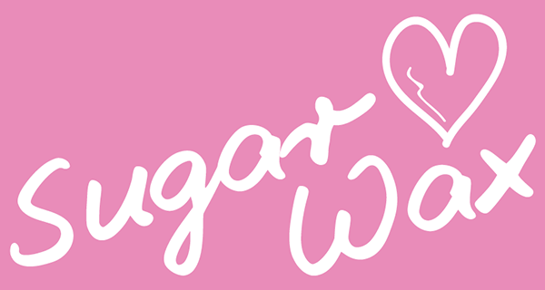

---

# *Sugar-Wax Beauty Studio*

The Sugar-Wax Beauty Studio website is the online-representative of the beauty saloon which provides different services for women:
Waxing, Sugaring, lashes and brows beautyfication, nail manicure. The website visitors can quickly find the Sugar-Wax Beauty Studio prices, location, contact phone and book a time visit to it. Also they can see how the Sugar-Wax Beauty Studio looks like inside and outside.

The site can be accessed by this [link](https://dimmando.github.io/studio/)

---
## User Stories

### First Time Visitor Goals:

* As a First Time Visitor, I want to easily understand the main purpose of the site and also if I have reached to the needed place for me. So I can read about type of organization and services provided immediately in the center of the screen.
* As a First Time Visitor, I want to be able easily navigate through the website, so I can find the content required.
* As a First Time Visitor, I want to see the prices to compare it with the other competitors.

### Returning Visitor Goals:

* As a Returning Visitor, I want to see how the Beauty Studio looks like, so I can make a final choice where to get services.
* As a Returning Visitor, I want to see phone number and opening hours to ask for some details, so that I can easily contact with them directly.
* As a Returning Visitor, I want to see if location close to me, so that I can read the address and see the Google Map.
* As a Returning Visitor, I want to find a way how to book an appointment with the specialist in the Beauty Studio, so that I can plan it.

### Frequent Visitor Goals:
* As a Frequent User, I want to have easy way for frequently booking a visiting time, so that I can do it quickly with minimum clicks.
* As a Frequent User, I want to see prices always on top to see if they have not changed. 

## Features

+ ### Navbar

+ ##### Navigation
    - Positioned at the top of the page.
    - Contains image logo of the Sugar-Wax Beauty Studio on the left side.
    - Contains text logo/name as type of business, Beauty Studio, in the center.
    - Contains navigation links on the right side:
        * HOME - leads to the home page where users can see main information from Sugar-Wax Beauty Studio and quick link in form button "BOOK NOW!" to book an appointment page for frequent users.
        * BOOKING - link to book an appointment page as the main way to obtain services from Sugar-Wax Beauty Studio.
        * OUR STUDIO - leads to the gallery page where users can see how Sugar-Wax Beauty Studio looks like.
        * CONTACTS - leads to the contact information and opening hours info back to the home page but scrolled down to easily find the contact information at any time of navigation.
    - The links have animated hover effect.
    - The navigation is clear and easy to understand for the user.
    

    - The navigation bar is responsive:
        * On mobile devices: 
            - navigation bar filled with the logo at the left, text logo/name in the center and a hamburger menu implemented on the right side of the navigation bar.      
            
        
            - When the hamburger menu is clicked, there is dropdown menu with the links in the same order.
            

---

+ ### Home Page

    - Represent: 

        * Services provided by Sugar-Wax Beauty Studio.
        * Prices on services.
        * Contact information with opening hours and Google Map fragment insertion.

    

---

+ #### Hero Section

    - Hero section have a fixed background image.

    - Hero section have the block section below the image that consist:

        * The name of the company.
        * Short description of the company's philosophy.
        * Contact button that leads directly to the contact page.

    
    

--- 

+ #### Highlights Section

    - Highlight Section has 4 cards with strong descriptive characteristics of the company.

    - Tells website visitors how well animals are in the Sugar-Wax Beauty Studio.

    - Attracts viewers to use this company for animal adoption.

    
    

    ---
+ #### Testimonials Section

    - Testimonials Section has three feedbacks from people who were satisfied with the company's service.

    - Each card has a picture of an animal with its owner.

    - Each card has a story from the people who had an experience of using the Sugar-Wax Beauty Studio.

    - Each card has a name of the pet's owner.

​
    

---
+ #### Call to Action Section

    - Call to Action Section has an explicit message for the visitors of the website to contact the company.

    - Is also has a button that directs to the contact page.
​
    

---
+ #### Footer

    - Footer contains social media links that open in a new tab.
​
    
​
---
+ ### Gallery Page

    - Gallery page has a hero image and an introduction message for the visitors that contains an incentive to contact the company.

    - It has a button right after the introduction message that leads to the contact form page.

    - It has photos of the animals that a present in the Sugar-Wax Beauty Studio in real-time.

        - The gallery is responsive: the size of the photo depends on the user's screen.
        - Each image has a description of the animal that appears on hover.
        - description information contains the name of the animal and its characteristics.

    - It has a call to action section below the gallery with the incentivizing message and the button that leads to the contact form.

    - It has a footer identical to the home page's footer.
    
​
    

---
+ ### Contact page

    - Contact page has a contact form:

        - All text input fields are customized.
        - Labels are animated when the input field is in focus and are not empty.
        - All inputs are set to be required to fill out.
        - It has to checkboxes for the visitors to fill voluntary:

            - The 1st is - ADAPT, which helps the company to understand the motive of the visitor.
            - The 2nd is - DONATE, which motivates users to consider financial support for the company. 

        - The submit button is animated on hover.

    - The page is responsive on all common screen sizes.

    - The submit button leads to the response page.
​
    

---
+ ### Response page

    - Response page appears after submitting the contact form.
    - It contains the thank you message and the promise to get in touch with the applicant within 24 hours.
    - It will automatically direct the user to the main page in 10 seconds.

    

---
## Technologies Used

- [HTML](https://developer.mozilla.org/en-US/docs/Web/HTML) was used as the foundation of the site.
- [CSS](https://developer.mozilla.org/en-US/docs/Web/css) - was used to add the styles and layout of the site.
- [CSS Flexbox](https://developer.mozilla.org/en-US/docs/Learn/CSS/CSS_layout/Flexbox) - was used to arrange items simmetrically on the pages.
- [CSS Grid](https://developer.mozilla.org/en-US/docs/Web/CSS/grid) - was used to make "gallery" and "contact" pages responsive.
- [CSS roots](https://developer.mozilla.org/en-US/docs/Web/CSS/:root) was used to declaring global CSS variables and apply them throughout the project. 
- [Balsamiq](https://balsamiq.com/) was used to make wireframes for the website.
- [VSCode](https://code.visualstudio.com/) was used as the main tool to write and edit code.
- [Git](https://git-scm.com/) was used for the version control of the website.
- [GitHub](https://github.com/) was used to host the code of the website.
- [GIMP](https://www.gimp.org/) was used to make and resize images for the README file.

---
## Design

### Color Scheme

- Soft blue color was used as the main color of the website due to its phycological effect on people's minds. As this color is associated with trustworthiness and reliability, website visitors could build a firm believe in the organization "Sugar-Wax Beauty Studio".

- Light Blue Color was used as a background color since this color creates a sense of tranquility and makes a connection between animal's ownership and peacefulness.

- Purple color was used to make an emphasis on the logo and leave a memorable effect on the website visitors.

### Typography

- Lato Google Font was used as the main font of the website in order to increase readability of the content on the pages.

- Lobster Google Font was used to attract viewers' attention to the company's logo, to make an accent on the strong points of the company, and to incentivize visitors to contact "Sugar-Wax Beauty Studio".

### Wireframes

#### Mobile devices

- [Home Page. Mobile Screen](documentation/mobile_home_page.png)
- [Gallery Page. Mobile Screen](documentation/mobile_gallery_page.png)
- [Contact Page. Mobile Screen](documentation/mobile_contact_form_page.png)
- [Response Page. Mobile Screen](documentation/mobile_response_page.png)

#### Tablets

- [Home Page. Tablet Screen](documentation/tablet_home_page.png)
- [Gallery Page. Tablet Screen](documentation/tablet_gallery_page.png)
- [Contact Page. Tablet Screen](documentation/tablet_contact_form_page.png)
- [Response Page. Tablet Screen](documentation/tablet_response_page.png)

#### Desktop

- [Home Page. Desktop Screen](documentation/desktop_home_page.png)
- [Gallery Page. Desktop Screen](documentation/desktop_gallery_page.png)
- [Contact Page. Desktop Screen](documentation/desktop_contact_form_page.png)
- [Response Page. Desktop Screen](documentation/desktop_response_page.png)

---

## Testing

Please refer to the [TESTING.md](TESTING.md) file for all test-related documentation.

---

## Deployment

### Deployment to GitHub Pages

- The site was deployed to GitHub pages. The steps to deploy are as follows: 
  - In the [GitHub repository](https://github.com/IuliiaKonovalova/animal_shelter), navigate to the Settings tab 
  - From the source section drop-down menu, select the **Main** Branch, then click "Save".
  - The page will be automatically refreshed with a detailed ribbon display to indicate the successful deployment.

The live link can be found [here](https://iuliiakonovalova.github.io/animal_shelter)

### Local Deployment

In order to make a local copy of this project, you can clone it.
In your IDE Terminal, type the following command to clone my repository:

- `git clone https://github.com/IuliiaKonovalova/animal_shelter.git`

- Alternatively, if you use Gitpod, you can [click here](https://gitpod.io/#https://github.com/IuliiaKonovalova/animal_shelter), which will start the Gitpod workspace for you.

---

## Future improvements
- add custom 404 page;

---
## Credits

+ #### Media

    - All the images for the website were captured by myself or captured and provided by my wife as her own business environment and a main customer of website.
    - Image Logo created by third party and belongs to my wife.

+ #### Tools

    - [Adobe Photoshop](https://www.adobe.com) was used to resize and crop images.
    - [TinyPNG](https://tinypng.com/) was used to smart WebP, PNG and JPEG compression for faster Websites.
---
