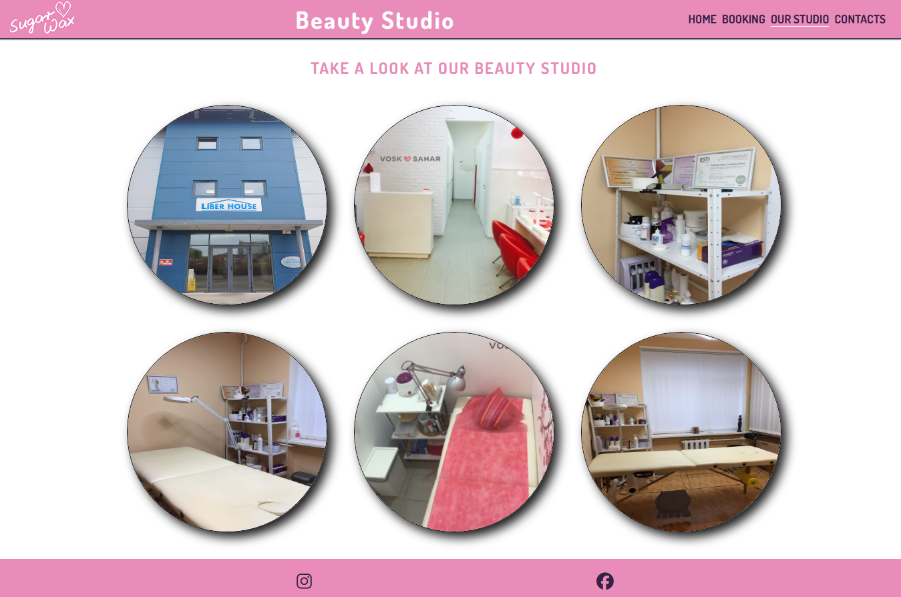

---

# *Sugar-Wax Beauty Studio*

The Sugar-Wax Beauty Studio website is the online-representative of the beauty saloon which provides different services for women:
Waxing, Sugaring, lashes and brows beautyfication, nail manicure. The website visitors can quickly find the Sugar-Wax Beauty Studio prices, location, contact phone and book a time visit to it. Also they can see how the Sugar-Wax Beauty Studio looks like inside and outside.

The site can be accessed by this [link](https://dimmando.github.io/studio/)

---
## User Stories

### First Time Visitor Goals:

* As a First Time Visitor, I want to easily understand the main purpose of the site and also if I have reached to the needed place for me. So I can read about type of organization and services provided immediately in the center of the screen.
* As a First Time Visitor, I want to be able easily navigate through the website, so I can find the content required.
* As a First Time Visitor, I want to see the prices to compare it with the other competitors.

### Returning Visitor Goals:

* As a Returning Visitor, I want to see how the Beauty Studio looks like, so I can make a final choice where to get services.
* As a Returning Visitor, I want to see phone number and opening hours to ask for some details, so that I can easily contact with them directly.
* As a Returning Visitor, I want to see if location close to me, so that I can read the address and see the Google Map.
* As a Returning Visitor, I want to find a way how to book an appointment with the specialist in the Beauty Studio, so that I can plan it.

### Frequent Visitor Goals:
* As a Frequent User, I want to have easy way for frequently booking a visiting time, so that I can do it quickly with minimum clicks.
* As a Frequent User, I want to see prices always on top to see if they have not changed. 

## Features

+ ### Navbar

+ ##### Navigation
    - Positioned at the top of the page.
    - Contains image logo of the Sugar-Wax Beauty Studio on the left side.
    - Contains text logo/name as type of business, Beauty Studio, in the center.
    - Contains navigation links on the right side:
        * HOME - leads to the home page where users can see main information from Sugar-Wax Beauty Studio and quick link in form button "BOOK NOW!" to book an appointment page for frequent users.
        * BOOKING - link to book an appointment page as the main way to obtain services from Sugar-Wax Beauty Studio.
        * OUR STUDIO - leads to the gallery page where users can see how Sugar-Wax Beauty Studio looks like.
        * CONTACTS - leads to the contact information and opening hours info back to the home page but scrolled down to easily find the contact information at any time of navigation.
    - The links have animated hover effect.
    - The navigation is clear and easy to understand for the user.
    

    - The navigation bar is responsive:
        * On mobile devices: 
            - navigation bar filled with the logo at the left, text logo/name in the center and a hamburger menu implemented on the right side of the navigation bar.      
            
        
            - When the hamburger menu is clicked, there is dropdown menu with the links in the same order.
            

---

+ ### Home Page

    - Represent: 

        * Services provided by Sugar-Wax Beauty Studio.
        * Prices on services.
        * Contact information with opening hours and Google Map fragment insertion.
        * It has a footer that contains social media links that open in a new tab.
​
    

---

+ ### Booking page

    - Booking page has a form to book an appointment:

        - All text input fields are customized.
        - Labels are animated when the input field is in focus.
        - All inputs are set to be required to fill out.
        - The submit/Book Now! button is animated on hover.

    - The page is responsive on all common screen sizes.
    - The submit/Book Now! button leads to the response page.
 ​   - It has a footer identical to the home page's footer.
 
    

---

+ ### Response page
    - Response page appears after submitting the booking form.
    - It contains the thank you message and the promise to get in touch with the customer.
    - It has a footer identical to the home page's footer.

    
​
---

+ ### Our studio page

    - Our studio page has a list of Sugar-Wax Beauty Studio photos inside and outside for the visitors who wants to see how it looks like.
    - The gallery of photos is responsive: the photos aligned depends on the user's screen.
    - It has a footer identical to the home page's footer.
    ​
    

+ ### Contacts page

    - It's not an independant page but Contacts page leads to scrolled down Sugar-Wax Beauty Studio main page so users can quick find contact information even though they didn't scroll down the main page before and didn't notice that information.
    - It includes location address, phone number, opening hours information.
    - It includes also Google Map insertion so users can open it and navigate at once.
    ​
    

---
## Technologies Used

- [HTML](https://developer.mozilla.org/en-US/docs/Web/HTML) - was used as the foundation of the site.
- [CSS](https://developer.mozilla.org/en-US/docs/Web/css) - was used to add the styles and layout of the site.

## Frameworks, Libraries & Programes Used
- [Google fonts](https://fonts.google.com) - Google fonts were used to import the 'Dosis' font into the style.css file which is used on all pages throughout the project

- [Font Awesome](https://fontawesome.com) - Font Awesome was used on all footer of the pages throughout the website to add icons for aesthetic and UX purposes.

- [Git](https://gitpod.io) - Git was used for version control by utilizing the Gitpod terminal to commit to Git and Push to GitHub.

- [GitHub](https://github.com) - GitHub is used to store the projects code after being pushed from Git.

---
## Design

### Color Scheme

- Tender colors of Sugar-Wax Beauty Studio website were provided by my wife - main future business customer.

### Typography

- Dosis Google Font was used as the main font of the website in order to increase readability and beautyfication of the content on the pages.

### Wireframes

#### Mobile devices

- [Home Page. Mobile Screen](documentation/mobile_home_page.jpg)
- [Gallery Page. Mobile Screen](documentation/mobile_gallery_page.jpg)
- [Contact Page. Mobile Screen](documentation/mobile_booking_page.jpg)
- [Response Page. Mobile Screen](documentation/mobile_response_page.jpg)

#### Tablets/Desktop

- [Home Page. Tablet/Desktop Screen](documentation/tablet_home_page.jpg)
- [Gallery Page. Tablet/Desktop Screen](documentation/tablet_gallery_page.jpg)
- [Contact Page. Tablet/Desktop Screen](documentation/tablet_booking_page.jpg)
- [Response Page. Tablet/Desktop Screen](documentation/tablet_response_page.jpg)

---

## Testing

Please refer to the [TESTING.md](TESTING.md) file for all test-related documentation.

---

## Deployment

### Deployment to GitHub Pages

- The site was deployed to GitHub pages. The steps to deploy are as follows: 
  - In the [GitHub repository](https://github.com/dimmando/studio), navigate to the Settings tab 
  - From the source section drop-down menu, select the **Main** Branch, then click "Save".
  - The page will be automatically refreshed with a detailed ribbon display to indicate the successful deployment.

The live link can be found [here](https://dimmando.github.io/studio/)

### Local Deployment

In order to make a local copy of this project, you can clone it.
In your IDE Terminal, type the following command to clone my repository:

- `git clone https://github.com/dimmando/studio.git`

- Alternatively, if you use Gitpod, you can [click here](https://gitpod.io/#https://github.com/dimmando/studio), which will start the Gitpod workspace for you.

---

## Future features
- add custom 404 page;

---
## Credits

+ #### Media

    - All the images for the website were captured by myself or captured and provided by my wife as her own business environment and a main customer of website.
    - Image Logo created by third party and belongs to my wife.

+ #### Tools

    - [Adobe Photoshop](https://www.adobe.com) was used to resize and crop images.
    - [TinyPNG](https://tinypng.com/) was used to smart WebP, PNG and JPEG compression for faster Websites.
---
