# TESTING

## Compatibility

In order to confirm the correct functionality, responsiveness, and appearance:

+ The website was tested on the following browsers: Chrome, Firefox, Edge.

    - Chrome:

    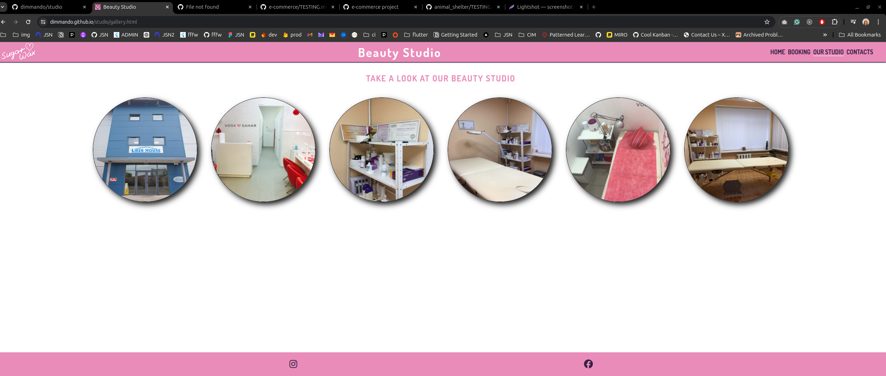

    - FireFox:

    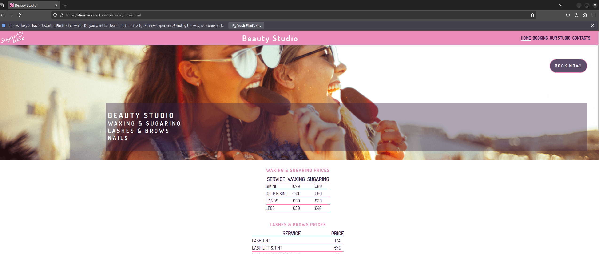

    - Edge:

    

## Responsiveness

+ The website was checked by Responsive Viewer - a trial version of Chrome browser extension:

    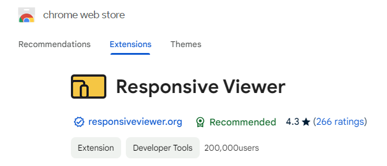

    - Main Page:

    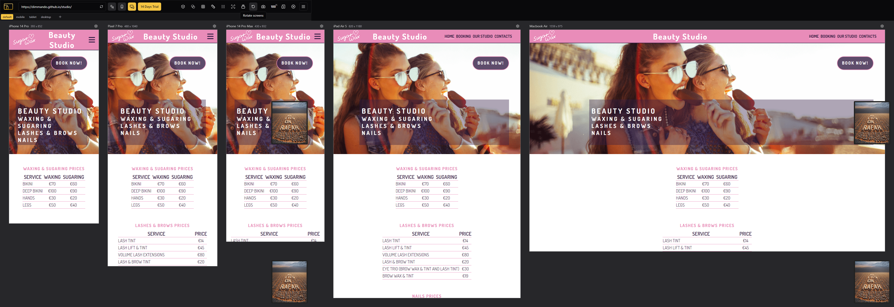

    - Gallery Page:

    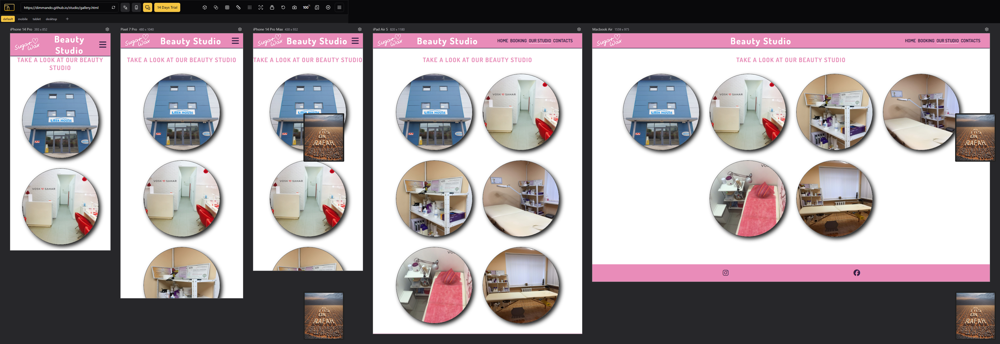

    - Booking Page:

    

    - Response Page:

    

+ The functionality of the links in the website was checked as well by different users.

---
## Validator testing
+ ### HTML
  #### Home Page
    - No errors or warnings were found when passing through the official W3C validator.

    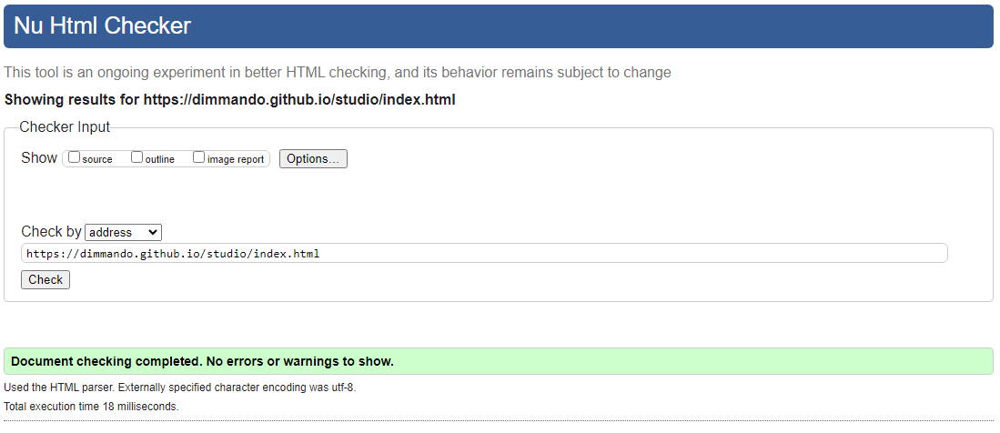
    
  #### Our Studio/Gallery Page
    - Only 1 warning was found when passing through the official W3C validator.

    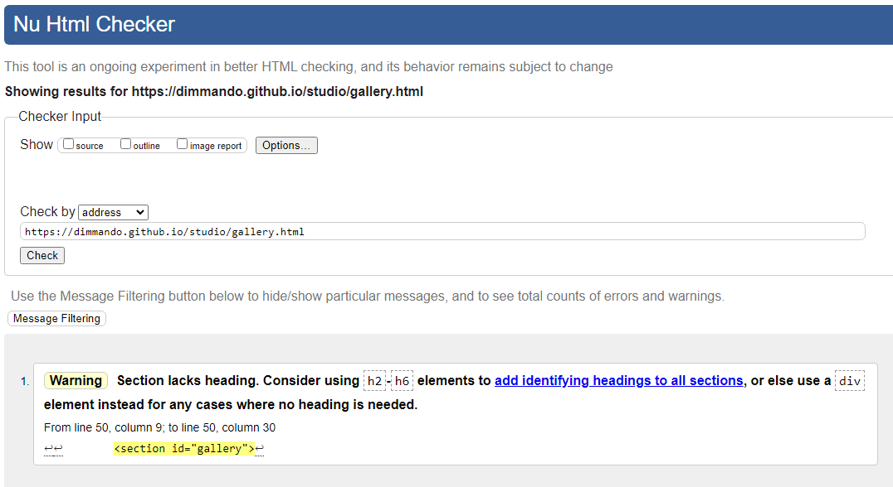

  #### Booking Page
    - No errors or warnings were found when passing through the official W3C validator.

    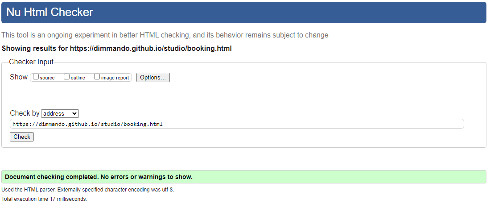

  #### Response Page
    - No errors or warnings were found when passing through the official W3C validator.

    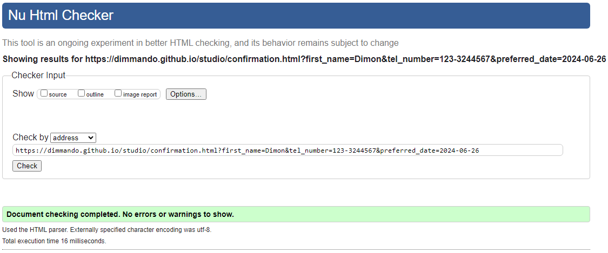
    
+ ### CSS
  No errors or warnings were found when passing through the official W3C (Jigsaw) validator

  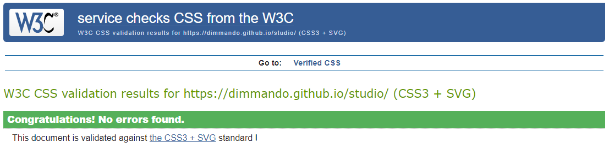
  

+ ## LightHouse report

    - Using lighthouse in devtools I confirmed that the website is performing well, accessible and colors and fonts chosen are readable.
    
  ### Home page

  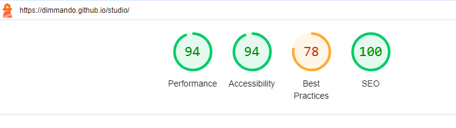

  ### Gallery page

  

  ### Contact page

  

  ### Response page

  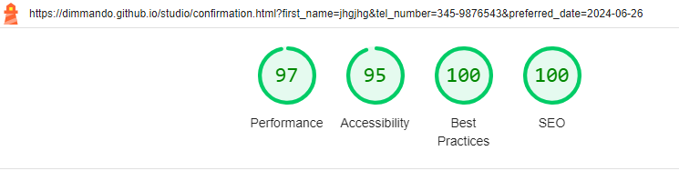

---
​
## Bugs
+ ### Solved bugs
    1. Pictures at Our Studio page/kind of gallery didn't want to align at the center of the page.
    
        *Solutions:* Alignment was done by using flex instruction.

+ ### Unsolved bugs
    - None.
+ ### Mistakes
    - Mistake was made in alignment Google Map insertion on Home Page using HTML code that didn't allow to scale all page on small screen like 375px correctly. It have been solved by styling alignment in CSS file instead HTML.
    
---