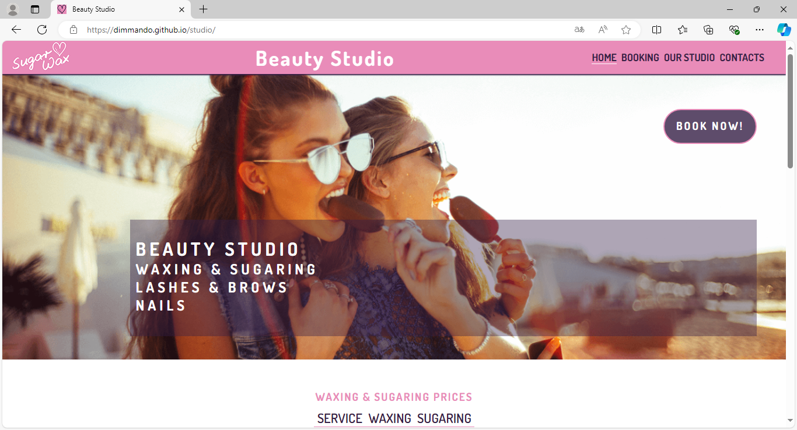

# TESTING

## Compatibility

In order to confirm the correct functionality, responsiveness, and appearance:

+ The website was tested on the following browsers: Chrome, Firefox, Edge.

    - Chrome:

    

    - FireFox:

    

    - Edge:

    

## Responsiveness

+ The website was checked by Responsive Viewer - a trial version of Chrome browser extension:

    

    - Main Page:

    

    - Gallery Page:

    

    - Booking Page:

    

    - Response Page:

    

+ The functionality of the links in the website was checked as well by different users.

---
## Validator testing
+ ### HTML
  #### Home Page
    - No errors or warnings were found when passing through the official W3C validator.

    
    
  #### Our Studio/Gallery Page
    - Only 1 warning was found when passing through the official W3C validator.

    

  #### Booking Page
    - No errors or warnings were found when passing through the official W3C validator.

    

  #### Response Page
    - No errors or warnings were found when passing through the official W3C validator.

    
    
+ ### CSS
  No errors or warnings were found when passing through the official W3C (Jigsaw) validator

  
  

+ ## LightHouse report

    - Using lighthouse in devtools I confirmed that the website is performing well, accessible and colors and fonts chosen are readable.
    
  ### Home page

  

  ### Gallery page

  

  ### Contact page

  

  ### Response page

  

---

## Testing user stories
 
User Story |  Test | Pass
--- | --- | :---:
I want to understand the main purpose of the site | I can read text Beauty Studio and services provided just in the center of the screen. | &check;​
I want to be able easily navigate through the website | I can either scroll down and see at once an information related to services or choose required menu item and go to page interested for me | &check;​
I want to see the prices to compare it with the other competitors | Prices we can see at once under the list of the services | &check;
I want to see how the Beauty Studio looks like | I can choose OUR STUDIO menu item and go to page with the photos gallery | &check;
I want to see phone number and opening hours | I can easily scroll down to the bottom or choose CONTACTS menu item and go to contact information at the bottom of Main Page | &check;
I want to see if location close to me | I can see the Google Map insertion at the bottom of Main Page, open it and make a pathway to me | &check;
I want to find a way how to book an appointment with the specialist in the Beauty Studio | I can tap/click on the button BOOK NOW! just on the Main Page at start screen or choose the BOOKING menu item and go to the Booking page | &check;
I want to have easy way for frequently booking a visiting time | I can do it quickly by tapping/clicking button BOOK NOW! just on the Main Page at start screen | &check;
I want to see prices always on top | Prices always under heading text of the services provided after background picture with the girls | &check;

## Bugs
+ ### Solved bugs
    1. Pictures at Our Studio page/kind of gallery didn't want to align at the center of the page.
    
        *Solutions:* Alignment was done by using flex instruction.

+ ### Unsolved bugs
    - None.
+ ### Mistakes
    - Mistake was made in alignment Google Map insertion on Home Page using HTML code that didn't allow to scale all page on small screen like 375px correctly. It have been solved by styling alignment in CSS file instead HTML.
    
---